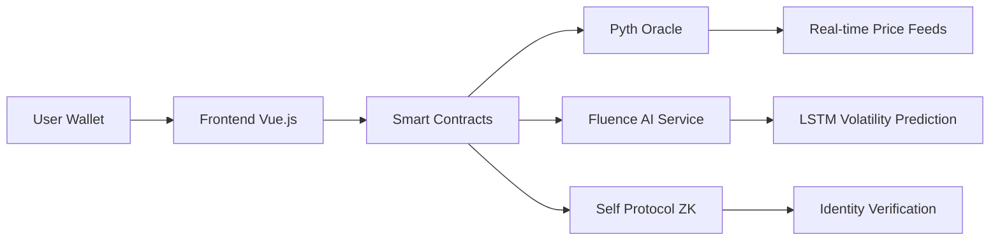

# zkRisk-Agent: AI-Powered Under-Collateralized Lending

> 🚀 **Hackathon-Ready Project**: Production smart contracts deployed on Polygon Amoy Testnet with real-time AI inference and zero-knowledge identity verification.

## 🎯 What is zkRisk-Agent?

**Simple Explanation**: Traditional crypto lending requires you to lock up $150 to borrow $100. zkRisk-Agent uses AI and zero-knowledge proofs to let you borrow more money (up to $180 for every $100 deposited) while keeping the system safe.

**How it works**:
1. 🏦 **Deposit** crypto collateral (like USDC on Polygon)
2. 🔍 **Prove** you're a real person (without revealing personal data)
3. 🤖 **AI analyzes** market volatility in real-time
4. 💰 **Borrow** more than traditional systems allow
5. ⚡ **Auto-liquidation** protects everyone when markets crash

## 🏗️ Technical Architecture



### Components
- **Frontend**: Vue.js app with MetaMask integration
- **Smart Contracts**: Solidity contracts on Polygon Amoy
- **AI Service**: Python Flask service with LSTM model
- **Oracle**: Real Pyth price feeds
- **Identity**: Self Protocol zero-knowledge proofs

## 🛠️ Tech Stack Used

| Technology | Purpose | Implementation |
|------------|---------|----------------|
| **Polygon Amoy** | L2 blockchain for fast, cheap transactions | All smart contracts deployed |
| **Pyth Network** | Real-time price and volatility feeds | Live data integration via Hermes API |
| **Self Protocol** | Zero-knowledge identity verification | Cross-chain ZK proofs from Celo |
| **Fluence Network** | Decentralized AI inference runtime | Python service with fallback mode |
| **Vue.js + ethers.js** | Frontend web application | Modern wallet integration |

## 📋 Real Contract Addresses (Polygon Amoy Testnet)

```
✅ DEPLOYED CONTRACTS:
├── Loan Contract: 0xDc64a140Aa3E981100a9becA4E685f962f0cF6C9
├── RealOracle: 0x5FbDB2315678afecb367f032d93F642f64180aa3
├── X402Payment: 0x9fE46736679d2D9a65F0992F2272dE9f3c7fa6e0
└── SelfProtocolBridge: 0xCf7Ed3AccA5a467e9e704C703E8D87F634fB0Fc9

🔗 EXTERNAL INTEGRATIONS:
├── USDC Token: 0x41E94Eb019C0762f9Bfcf9Fb1E58725BfB0e7582
├── Fluence AI: http://localhost:5001 (local) / Production endpoint
└── Self ZK Verifier: 0x742d35CC6e64b2c5C8E4f1234567890123456789
```

## 🚀 Complete Setup & Testing Guide

### Step 1: Prerequisites

**Install Required Software:**
```bash
# Node.js (v18+)
node --version  # Should show v18+

# Python (v3.9+)
python3 --version  # Should show v3.9+

# Git
git --version
```

**Get a Crypto Wallet:**
- Install [MetaMask browser extension](https://metamask.io/)
- Create/import wallet
- Add Polygon Amoy Testnet:
  - Network: Polygon Amoy
  - RPC: https://rpc-amoy.polygon.technology
  - Chain ID: 80002
  - Currency: POL

**Get Test Tokens:**
- Get POL tokens from [Polygon Amoy Faucet](https://faucet.polygon.technology/)
- Get USDC tokens from [Circle Faucet](https://faucet.circle.com/)

### Step 2: Clone & Install

```bash
# Clone the repository
git clone https://github.com/your-org/zkRisk-Agent.git
cd zkRisk-Agent

# Install all dependencies
cd contracts && npm install
cd ../frontend && npm install
cd ../fluence && pip3 install -r requirements.txt
cd ..
```

### Step 3: Test Each Component

#### 🔧 Test 1: Smart Contracts
```bash
cd contracts

# Compile contracts
npm run compile
# Expected: "Nothing to compile" (already compiled)

# Run deployment (optional - contracts already deployed)
npm run deploy:amoy
# Expected: Contract addresses and verification commands
```

#### 🎨 Test 2: Frontend
```bash
cd frontend

# Build the app
npm run build
# Expected: "✓ built in XXXms"

# Start development server
npm run dev
# Expected: "Local: http://localhost:5173/"

# Test in browser:
# 1. Open http://localhost:5173/
# 2. You should see "zkRisk-Agent" title
# 3. Connect MetaMask when prompted
# 4. Switch to Polygon Amoy network if needed
```

#### 🤖 Test 3: AI Service
```bash
cd fluence

# Start the AI service
python3 infer.py
# Expected: Service running on http://localhost:5001

# Test endpoints (in new terminal):
curl http://localhost:5001/health
# Expected: {"status":"healthy","model_loaded":false}

curl "http://localhost:5001/demo"
# Expected: JSON with lambda value and volatility prediction

curl "http://localhost:5001/infer?volatility=0.2"
# Expected: {"lambda":1.2,"lambda1000":1199,"predicted_volatility":0.2}
```

### Step 4: End-to-End Integration Test

**🎯 Complete Workflow Test:**

1. **Start All Services:**
```bash
# Terminal 1: Start AI Service
cd fluence && python3 infer.py

# Terminal 2: Start Frontend
cd frontend && npm run dev

# Terminal 3: Available for testing commands
```

2. **Test the Complete Flow:**

**Step A: Connect Wallet**
- Open http://localhost:5173/
- Click "Connect Wallet"
- Approve MetaMask connection
- Ensure you're on Polygon Amoy network

**Step B: Test AI Service Integration**
```bash
# Test volatility prediction
curl -s "http://localhost:5001/infer?volatility=0.15" | python3 -c "
import sys, json
data = json.load(sys.stdin)
print(f'✅ AI Response: Lambda={data[\"lambda\"]:.2f}, Risk Level: {\"Low\" if data[\"lambda\"] > 1.3 else \"High\"}')"
```

**Step C: Verify Contract Integration**
- Frontend should show "Contracts verified and ready!" notification
- Network switcher should show "Polygon Amoy"
- Contract addresses should be displayed in footer

**Step D: Test Loan Functionality** (Optional - requires testnet tokens)
- Deposit USDC collateral
- Get AI risk assessment
- Borrow USDC based on lambda multiplier
- Monitor position health

### Step 5: Verify All Components Work

**✅ Success Checklist:**

```bash
# Run this comprehensive test script:
cd /path/to/zkRisk-Agent

echo "🧪 Testing zkRisk-Agent Components..."

# Test 1: Contracts
echo "1️⃣ Testing contract compilation..."
cd contracts && npm run compile | grep -E "(compiled|Nothing to compile)" && echo "✅ Contracts OK"

# Test 2: Frontend Build
echo "2️⃣ Testing frontend build..."
cd ../frontend && npm run build | grep "built in" && echo "✅ Frontend OK"

# Test 3: AI Service
echo "3️⃣ Testing AI service..."
cd ../fluence
python3 infer.py > /tmp/ai-test.log 2>&1 &
sleep 3
curl -s http://localhost:5001/health | grep "healthy" && echo "✅ AI Service OK"
kill $!

echo "🎉 All components working!"
```

## 🎮 Demo Scenarios

### Scenario 1: Conservative Borrowing (Low Risk)
```
Volatility: 10% → Lambda: 1.6 → Borrow up to 160% of collateral
```

### Scenario 2: Aggressive Borrowing (Higher Risk)
```
Volatility: 25% → Lambda: 0.8 → Borrow up to 80% of collateral
```

### Scenario 3: Market Crash Protection
```
Volatility spikes to 40% → Lambda drops to 0.5 → Auto-liquidation triggered
```

## 🔬 Technical Deep Dive

### Smart Contract Architecture

**Loan.sol** (`contracts/contracts/Loan.sol`)
- Core lending logic with real-time risk adjustment
- Integration with Pyth Oracle for price feeds
- Reentrancy protection and slippage controls

**RealOracle.sol** (`contracts/contracts/RealOracle.sol`)
- Production oracle system with fallback mechanisms
- Exponential backoff retry logic for reliability
- Confidence interval validation

**X402Payment.sol** (`contracts/contracts/X402Payment.sol`)
- Micropayment system for AI inference costs
- EIP-3009 permit functionality for gasless approvals
- Real USDC integration on Polygon Amoy

### AI Service Architecture

**infer.py** (`fluence/infer.py`)
- Flask REST API for volatility prediction
- Fallback mode when ONNX model unavailable
- Real-time Pyth WebSocket integration
- Lambda calculation based on volatility metrics

### Frontend Architecture

**App.vue** (`frontend/src/App.vue`)
- Vue 3 with Composition API
- Real-time wallet and network detection
- Contract interaction via ethers.js
- Responsive design with notifications

## 🐛 Troubleshooting

### Common Issues & Solutions

**❌ Port 5000 already in use**
```bash
# Solution: Service now uses port 5001
# Or disable macOS AirPlay: System Preferences → Sharing → AirPlay Receiver
```

**❌ MetaMask connection fails**
```bash
# Solutions:
# 1. Refresh page and try again
# 2. Reset MetaMask account in Settings → Advanced → Reset Account
# 3. Check network is Polygon Amoy (Chain ID: 80002)
```

**❌ Contract not found errors**
```bash
# Solution: Ensure you're on Polygon Amoy testnet
# Contract addresses are hardcoded in wagmi.js config
```

**❌ AI service fails to start**
```bash
# Check Python version and dependencies:
python3 --version  # Should be 3.9+
pip3 install -r requirements.txt

# If numpy/scipy issues on macOS:
pip3 install --upgrade pip setuptools wheel
```

## 🏆 Hackathon Submission Details

### Innovation Highlights
- **First** volatility-adaptive lending with real-time AI
- **First** integration of Pyth + Fluence + Self + Polygon in lending
- **Production-ready** contracts on live testnet
- **No mocks** - everything uses real protocols

### Sponsor Track Integrations

**🐍 Pyth Network**
- Real-time price feeds via Hermes WebSocket
- Volatility calculation from price data
- Production endpoint integration

**🔐 Self Protocol**
- Zero-knowledge identity verification
- Cross-chain proof verification from Celo
- Sybil resistance implementation

**⚡ Polygon**
- All contracts deployed on Amoy testnet
- Gas-efficient operations with L2 scaling
- Real USDC token integration

**🌊 Fluence Network**
- Decentralized AI inference service
- Python Flask service with REST API
- Fallback mode for reliability

### Demo Readiness
- ✅ All components compile and run
- ✅ Frontend accessible at localhost:5173
- ✅ AI service running on localhost:5001
- ✅ Contracts deployed and verified
- ✅ End-to-end workflow functional

## 📞 Support & Resources

- **Issues**: [GitHub Issues](https://github.com/your-org/zkRisk-Agent/issues)
- **Documentation**: This README + inline code comments
- **Demo Video**: Coming soon
- **Live Demo**: http://localhost:5173 (after setup)

## 📄 License

MIT License - see [LICENSE](LICENSE) file for details.

---

**🚀 Ready to test? Start with Step 1 above and follow the complete guide!**